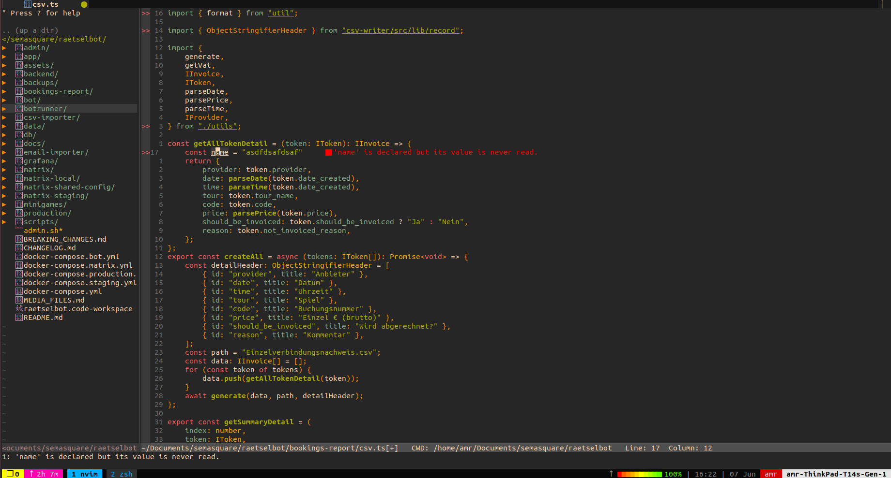
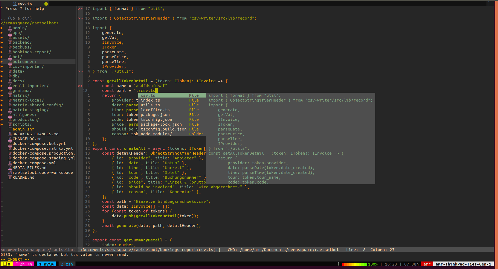

## Neovim Configuration
### Steps to install
  1. `mkdir ~/.config`
  2. `cd ~/.config`
  3. git clone this **Repo**
  4. make an alias `vim=neovim` to be able to use `neovim` as `vim` command

### Part of what you get
#### File navigation
  5. 
#### Lsp
  5. 
#### Path intellisense
  5. 
