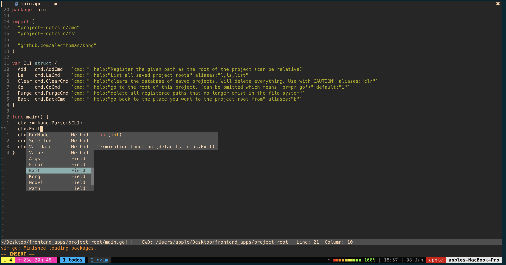
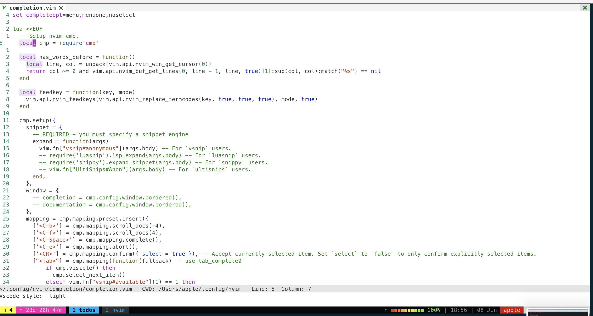
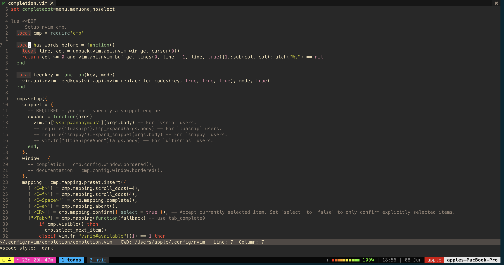

# My neovim configuration
### install neovim
  run `./install latest osx` or `./install.sh latest osx`
### setup
  1. `mkdir ~/.config`
  2. `cd ~/.config`
  3. git clone this repo

### Part of what you get
##### File navigation
   
##### Lsp
   
##### Path intellisense
   

##### Auto completion
   
##### Different color themes

